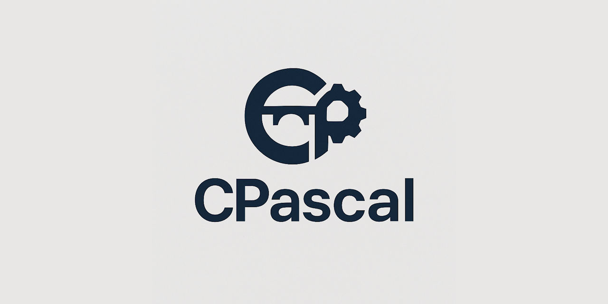

> 🚧 **CPascal is a Work in Progress**
>
> CPascal is currently under active development and evolving quickly. Some features described in this documentation may be incomplete, experimental, or subject to significant changes as the project matures.
>
> We welcome your feedback, ideas, and issue reports — your input will directly influence the direction and quality of CPascal as we strive to build the ultimate modern Pascal development platform.

# CPascal
### **A systems programming language with Pascal syntax and C semantics**

CPascal combines the readable syntax of Pascal with the semantic model and binary compatibility of C. It compiles to LLVM IR and maintains **full C ABI compatibility**, enabling seamless interoperation with existing C libraries and codebases without translation layers or bindings.

## 🎯 Design Philosophy

> **"Better C with Pascal Syntax"**

CPascal is designed as a modernized systems programming language where every construct maps directly to equivalent C constructs at the binary level. This ensures zero-overhead abstraction and complete compatibility while providing a cleaner, more structured syntax.

## ✨ Key Features

### 🔗 **Full C ABI Compatibility**
- All data types, function calls, and memory layouts identical to C
- Direct linking with any C library without bindings
- Binary-compatible function pointers and structures
- Identical memory layout and alignment rules

### 📝 **Clean Pascal Syntax**
- Structured programming constructs (`begin`/`end`, `if`/`then`/`else`)
- Strong typing with type safety
- Clear procedure/function distinction
- Readable control flow statements

### ⚡ **Zero Runtime Overhead**
- Direct compilation to efficient machine code via LLVM
- No garbage collection or automatic memory management
- No runtime type information (RTTI)
- Minimal runtime requirements

### 🌟 **Modern Language Features**
- **Multiple Assignment**: `A, B := GetCoordinates()`
- **Ternary Operator**: `Max := (A > B) ? A : B`
- **Compound Assignment**: `Value += 10`, `Flags or= $80`
- **Inline Assembly**: Extended assembly with input/output constraints
- **Variadic Functions**: Full C-style variadic function support
- **Module System**: Clean imports without preprocessor complexity

### 🎛️ **Advanced Systems Programming**
- Inline assembly with GCC-compatible extended syntax
- Atomic operations and memory barriers
- Direct hardware access and register manipulation
- Platform-specific optimizations

## 🚀 Quick Start

### Hello World

```cpascal
program HelloWorld;

function printf(const AFormat: PChar, ...): Int32; external;

begin
  printf("Hello, World!\n");
end.
````

### Graphics Application

```cpascal
program GraphicsDemo;

import Graphics, Math;
{$LIBPATH /usr/local/lib}
{$LINK SDL2}
{$LINK OpenGL32}

// External SDL2 functions
function SDL_Init(const AFlags: UInt32): Int32; external "SDL2";
function SDL_CreateWindow(const ATitle: PChar; const AX, AY, AW, AH, AFlags: Int32): Pointer; external "SDL2";

const
  SDL_INIT_VIDEO = $00000020;
  SDL_WINDOW_OPENGL = $00000002;

var
  Window: Pointer;
  Running: Boolean;

begin
  if SDL_Init(SDL_INIT_VIDEO) <> 0 then
    exit;

  Window := SDL_CreateWindow("CPascal Demo", 100, 100, 800, 600, SDL_WINDOW_OPENGL);
  if Window = nil then
    exit;

  Running := true;
  while Running do
  begin
    // Game loop
    ProcessEvents();
    UpdateGame();
    RenderFrame();
  end;

  SDL_DestroyWindow(Window);
  SDL_Quit();
end.
```

### Advanced Features

```cpascal
module DataStructures;

// Multiple assignment
function GetCoordinates(): (Int32, Int32);
begin
  Result := (100, 200);
end;

// Ternary operator and compound assignment
function ProcessData(const AValues: ^Int32; const ACount: Int32): Int32;
var
  LIndex, LSum, LMax: Int32;
begin
  LSum := 0;
  LMax := 0;

  for LIndex := 0 to ACount - 1 do
  begin
    LSum += AValues[LIndex];                    // Compound assignment
    LMax := (AValues[LIndex] > LMax) ? AValues[LIndex] : LMax;  // Ternary
  end;

  Result := LSum;
end;

// Inline assembly with constraints
function AtomicIncrement(const APtr: ^Int32): Int32; inline;
begin
  asm
    "lock incl %1"
    "movl %1, %0"
    : "=r" (Result)        // Output: register
    : "m" (APtr^)          // Input: memory location
    : "memory"             // Clobbered: memory
  end;
end;

// Union types
type
  TValue = union
    AsInt: Int32;
    AsFloat: Single;
    AsBytes: array[0..3] of UInt8;
  end;

var
  LValue: TValue;
begin
  LValue.AsInt := $3F800000;    // IEEE 754 for 1.0
  // LValue.AsFloat is now 1.0
end;
```

## 📊 C ABI Type Mapping

| CPascal Type | C Equivalent | Size | Description |
|--------------|--------------|------|-------------|
| `Int8` | `int8_t` | 1 | Signed 8-bit integer |
| `UInt8` | `uint8_t` | 1 | Unsigned 8-bit integer |
| `Int32` | `int32_t` | 4 | Signed 32-bit integer |
| `UInt32` | `uint32_t` | 4 | Unsigned 32-bit integer |
| `Int64` | `int64_t` | 8 | Signed 64-bit integer |
| `Single` | `float` | 4 | IEEE 754 single precision |
| `Double` | `double` | 8 | IEEE 754 double precision |
| `Boolean` | `bool` | 1 | C99 boolean |
| `Pointer` | `void*` | 8/4 | Platform pointer |
| `PChar` | `char*` | 8/4 | Null-terminated string |

**All record types map to C structs with identical layout and alignment.**

## 🏗️ Project Structure

```
project/
├── src/
│   ├── main.cpas         # Program entry point
│   ├── graphics.cpas     # Graphics module
│   ├── audio.cpas        # Audio module
│   └── platform/
│       ├── windows.cpas  # Platform-specific code
│       ├── linux.cpas
│       └── macos.cpas
├── lib/
│   ├── SDL2.lib         # External libraries
│   └── OpenGL32.lib
└── build/
    ├── obj/             # Compiled objects
    └── bin/             # Final executables
```

## 🎯 Target Applications

  - **Systems Programming**: Device drivers, OS components
  - **Game Development**: High-performance game engines
  - **Embedded Systems**: Microcontroller programming
  - **Performance-Critical Applications**: Real-time systems
  - **C Codebase Modernization**: Gradual migration from C

## 📚 Documentation

  - **[Language Specification](docs/CPASCAL-SPECIFICATION.md)** - Complete language reference
  - **[BNF Grammar](docs/CPASCAL-BNF.md)** - Formal grammar specification
  - **[Test & Coverage Report](docs/CPASCAL-TESTREPORT.md)** - View current test results and feature coverage.
  - **[C Migration Guide](docs/C-MIGRATION.md)** - Migrating from C to CPascal
  - **[API Reference](docs/CPASCAL-APIREFERENCE.md)** - Standard library documentation

### 📋 **Coding Standards**

  - **Naming**: `L` prefix for locals, `A` prefix for parameters
  - **Declarations**: Each variable on separate line, no inline `var`
  - **Parameters**: Always `const` unless `var`/`out` needed
  - **Testing**: Comprehensive tests for all new functionality
  - **Documentation**: Update relevant guides and inline docs

### 🏆 **Contributors**

<a href="https://github.com/tinyBigGAMES/JetVM/graphs/contributors">
  
</a>

*Join our growing community of developers building the future of Pascal development\!*

## 📄 License

This project is licensed under the **BSD 3-Clause License** - see the [LICENSE](https://github.com/tinyBigGAMES/CPascal?tab=readme-ov-file#BSD-3-Clause-1-ov-file) file for details.

```
BSD 3-Clause License

Copyright © 2025-present tinyBigGAMES™ LLC
All Rights Reserved.

Redistribution and use in source and binary forms, with or without
modification, are permitted provided that the following conditions are met:

1. Redistributions of source code must retain the above copyright notice
2. Redistributions in binary form must reproduce the above copyright notice
3. Neither the name of the copyright holder nor the names of its contributors
   may be used to endorse or promote products derived from this software
   without specific prior written permission.
```

## 📞 Support & Community

### 💬 **Community Channels**

  - 🏠 **Homepage**: [CPascal Homepage](https://cpascal.org) – Official website, documentation, and news  
  - 🐛 **Issues**: [GitHub Issues](https://github.com/tinyBigGAMES/CPascal/issues) - Bug reports & feature requests
  - 💬 **Discussions**: [GitHub Discussions](https://github.com/tinyBigGAMES/CPascal/discussions) - General questions & ideas
  - 💬 **Discord**: [Join our community](https://discord.gg/tPWjMwK) - Real-time chat & support
  - 🐦 **Bluesky**: [@tinybiggames.com](https://bsky.app/profile/tinybiggames.com) - Updates & announcements

## 🌟 Acknowledgments

  - 💖 **Built with love** for the Delphi community
  - 🎯 **Inspired by** Pascal's readable syntax and C's systems programming power
  - 🚀 **Focused on** practical, real-world usage scenarios
  - 🏆 **Committed to** enterprise-grade quality and performance
  - 🌍 **Supporting** the future of Pascal application development

### 🎖️ **Special Thanks**

  - **Delphi Community** - For continued support and feedback
  - **Beta Testers** - Early adopters who helped shape CPascal
  - **Contributors** - Everyone who has submitted issues, PRs, and improvements

-----

**Made with ❤️ by [tinyBigGAMES™](https://github.com/tinyBigGAMES)**

**CPascal** - *Where Pascal meets C, systems programming becomes elegant.*
